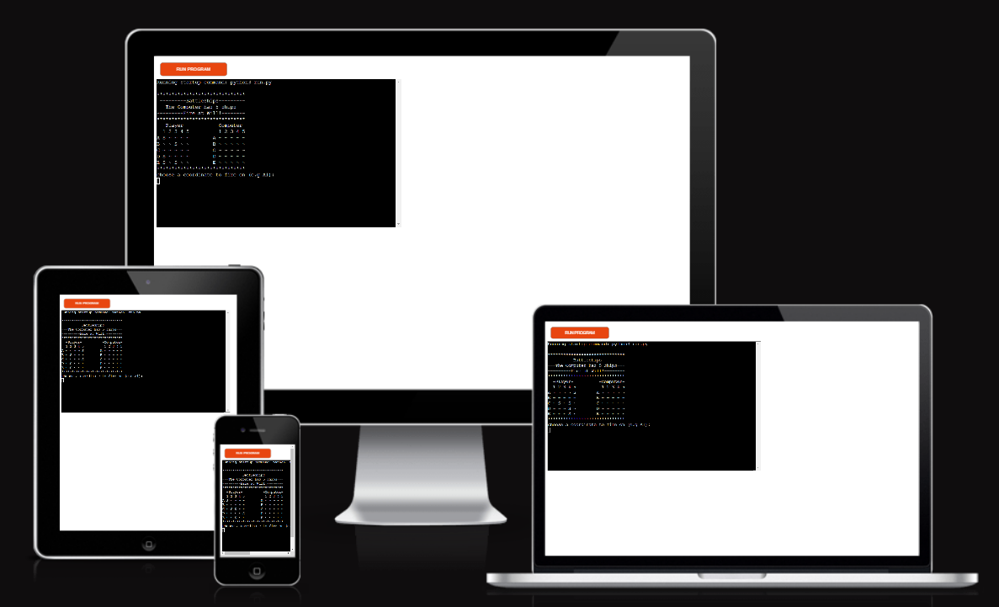
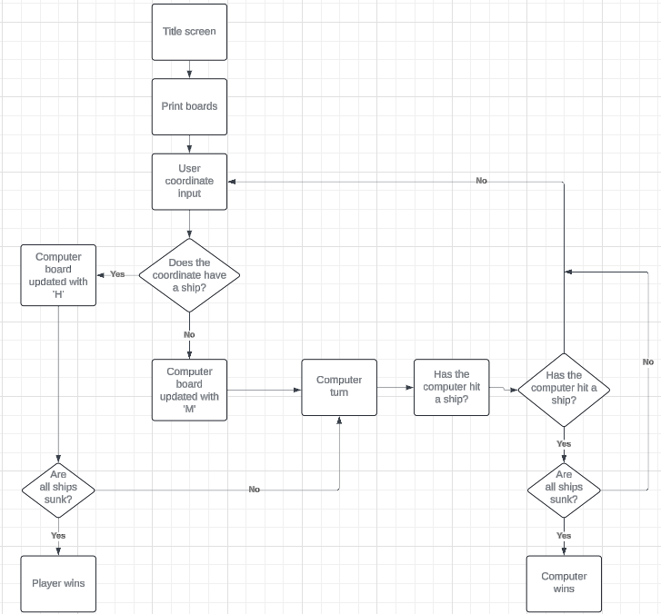
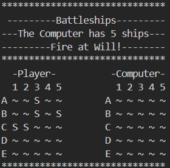
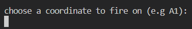
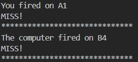
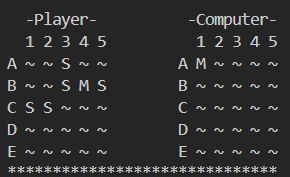
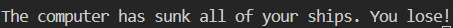
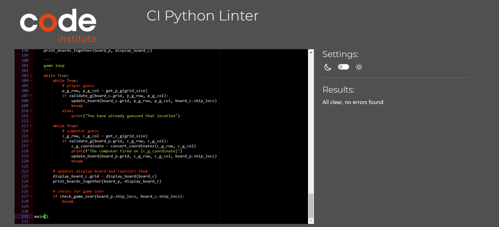
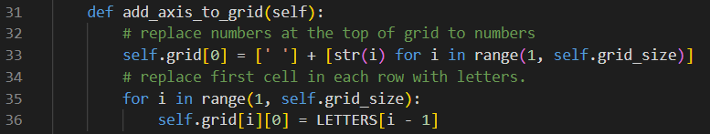

# Battleship game

## Introduction
For the Portfolio Project 3 - Python Essentials, The developer decided to build a battleships game.

Battleships is a turn based game were each player has a set number of battleships. Players take turns firing at the other players board to sink the other players ships before theirs are sunk.
### How To PLay
- The board is loaded up and populated with ships by the programme. 
- The player will guess a coordinate to target an enemy ship.
- The computer will guess a coordinate to target a player ship.
- First player to sink all five ships wins.

## UX
### Ideal User demographic
The ideal user demographic for this programme is:
- New users
- current users

#### New User Goals
As a new user, I want to be able to:
1. View my board and ship locations.
2. View the computers board without the ship locations.
3. be clearly instructed on my next task.

#### Current User Goals

1. Be told if my inputs are correct or if there are errors.
2. Know if I have hit a ship, missed, or previously guessed a loction already.
3. Be told if I have won or lost.
### Deployment Planes

To create a command-line application that allows the user to play a classic game of Battleships.

#### Stratergy

The programme incoorporates user needs as well as product objectives. The target audince is as follows:

- **Roles:**
    - New users
    - Current users

- **Demographic:**
    - All ages
    - All puzzle playing levels

- **Psychographic:**
    - Lifestyles:
        - Interest in games
        - Interest in battles
        - Interest in Ships
        - Interest in puzzles
    - Personality/Attitudes:
        - Focused
        - Forward-Thinking
        - Creative
    
The application needs to enable the **user** to:
- play the game "Battleship" using alpha characters and numbers.
- generate a random board on each play-through placing ships in different locations.

#### Scope

The scope outlines the defining requirements users need to access the programme whilst also meeting prodcut goals 

- Content Requirements:
     The user will be looking for:
    - Clear and concise instructions.
    - A consistent theme, and game play. 
- Functionality Requirements:
     The user will be able to:
    - Enter co-ordinates using numbers and letters.
    - End the program at the end of the game.

#### Structure

The project will be deployed on the Heroku terminal. No other styling design implemented.

#### Skeleton

A flow chart was created to show the flow of the programme.

## Features

### Imagery

- The Board class creates a 6x6 board. Axis are added by replcaing row 0 with numbers and column 0 with letters. 5 battleships are then placed on the board.
- Two boards are initially created and used for the functions. Player board and computer board.
- A copy of the computer board is created which hides all of the ships. 
- The player board and copy of the computer board are displayed side to side.

### Existing Features

#### Once the game is loaded:
- player and computer boards are created
- The copy of computer board is created
- The title message is printed
- player board and copy of computer board is printed

#### Playing the game
- User is prompted to input a coordinate
- Feedback on player guess is given
- Computer generates coordinate
- Feedback on computer guess is given

#### Updated Boards
- The player and copy board are printed to the terminal

#### Game OVer
- Once all the ships are sunk on either board. Display message given to user.

### Features Left To Implement

*There are no features left to implement from the initial scope of my project, however I have some features that I would like to add in the future.*
- Player can place their own ships.
- Ships of different lengths to be used.
- A bullets system that gives players a certain amount of lives. 
- A two player function.
- Let player choose the size of the board.

## Issues and Bugs

The developer ran into issues during the development of the programme, with the noteworthy ones listed below, along with solutions or ideas to implement in the future.

### Solved Bugs
-  The computer guess would print all tried coordinates if they had already been guessed. This was fixed by alterining the loop location to stop it repeating.

### Remaining bugs 
- When testing in Heroku. The game would sometimes stop the user inputting anything. This was very hard to reproduce and happened towards the end of the game. The developer could not find the cause of the bug and has been left in. 

## Technologies Used
### Main Languages Used
- [Python](https://en.wikipedia.org/wiki/Python_(programming_language) "Link to Python Wiki")

### Frameworks, Libraries and Programs USed
- [GitPod](https://gitpod.io/ "Link to GitPod homepage")
    - GitPod was used for writing code, committing, and then pushing to GitHub.
- [GitHub](https://github.com/ "Link to GitHub")
    - GitHub was used to store the project after pushing.
- [Lucid](https://lucid.app/ "Link to Lucid homepage")
    - Lucid was used to create a flowchart of information, making the logic of the game easily understood.
- [Am I Responsive?](http://ami.responsivedesign.is/# "Link to Am I Responsive Homepage")
    - Am I Responsive was used to generate mock-up imagery of the terminal showing the game in use on Heroku.

## Testing

Due to the nature of this project. Testing was mainly implemented throughout the building of the programme. This was done mainly through the terminal. Commit logs show this.
-Python tutor was also used to debugg the code.
Validation checked with invalid inputs:
- Valid = 'A1'. 
- testing was '11', 'AA', 'A11', 'A', '1', '', 'a1', 'Z3', 'A9'.
- Tested with invalid inputs: Such as using Type Errors and Value Errors, string instead of integers, out of bound inputs, same input twice.
- Tested in both Gitpod terminal and CI Heroku terminal.
- testing has been conducted by myself, Family and peers on slack through the peer-code-review channel, there is currently no reported issues that cause the game to break.

#### New User Goals:
1. As a new user, I want to view my board and ship locations.
- both boards are clearly displayed with titles at the start of the game

2. As a new user, I want to view the computers board without the ship locations.
- Copy of computer board is displayed to never show computer ship locations

3. As a new user, I want to be clearly instructed on my next task.
- Title screen explains game. Clear instructions for user input printed.

#### Current User
1. As a current user, I want to be told if my inputs are correct or if there are errors.
- All input is validated with appropriate error messages.

2. As a current user, I want to know if I have hit a ship, missed, or previously guessed a loction already.
- each guess is validated and returns outcome to the uswer in the terminal

3. As a current user, I want to be told if I have won or lost.
- Once a board is depleted of ships, game over message is displayed.

### Code Validation
The [PEP8 Online Checker](https://extendsclass.com/python-tester.html/) service was used to validate the code written in the run.py file.

The variable names chosen were too long for the maximum charachter count per line. 
Seleceted words were chosen to shorten these and a key was created to aid with translations. 

## User Testing

This was tested by my partner and slack peers, providing user experience issues. Also by my mentor throughout the process which led to changes and improvements.

## Deployment 
### GitHub
This project was developed using [GitPod](https://www.gitpod.io/ "Link to GitPod site"), which was then committed and pushed to GitHub using the GitPod terminal. To create a GitHub repository you must:

1. Sign in to your account on Github.
2. On the top left of the home screen, click the 'New' button.
3. Under 'Repository template', select the required template from the dropdown.
4. Enter a repository name and description of your project.
5. There is an option of adding a README file, a .gitignore file, or choosing a license.
6. Click the 'Create Repository' button and your repository will be created.

### Deploying on Heroku
To deploy this project to Heroku from its GitHub repository, the following steps were taken:

1. In your repository, type "pip freeze > requirements.txt" to create the list of dependencies to the requirements.txt file. Save, commit and push your changes to GitHub.

2. Create an account with [Heroku](https://www.heroku.com/ "Link to Heroku site"), selecting Python as the 'Primary development language'.

3. Go to your emails and click the link to verify your email address. The link will bring you to a page where you can create a password. Create a password and log in.

4. On the dashboard, click the 'create new app' button. Enter a unique name for your app and select your region. Click 'Create App'.

5. Go to the settings tab and click 'Reveal Config Vars'. Enter PORT as the KEY value and 8000 as the VALUE value.

6. Click 'Add Buildpack' and select 'Python' and 'Nodejs'. Python must be on the top of the list. Click and drag the buildpacks to the correct positions if needed.

7. Go to the deploy tab and, under 'Deployment method', click 'GitHub' and then 'Connect to GitHub'.

8. In 'Connect to GitHub', search for the repository you wish to use, then click 'Connect'.

9. If you 'Enable Automatic Deploys', Heroku will rebuild the app every time you push a change to GitHub. You can also choose to manually deploy using the 'Deploy Branch' option. Heroku will build the app and when it is finished, click the 'View' button to open the terminal.

## Credits
Chat GPT was used to produce the following code 

### Code 
- https://chatgpt.com/
- [Stack Overflow](https://stackoverflow.com/ "Link to Stack Overflow page")
- [ChatGPT](https://chatgpt.com/ "Link to ChatGPT page")
- [W3Schools](https://www.w3schools.com/ "Link to W3Schools page")
- [github](https://github.com/Becky139/Battleship.git "link to another students game")

## Acknowledgements 
- I would like to thank my partner for testing the code.
- I would like to thank my mentor Excellence for their help and guidance.
- I would like to thnk the slack community for their advice whilst testing the code.
